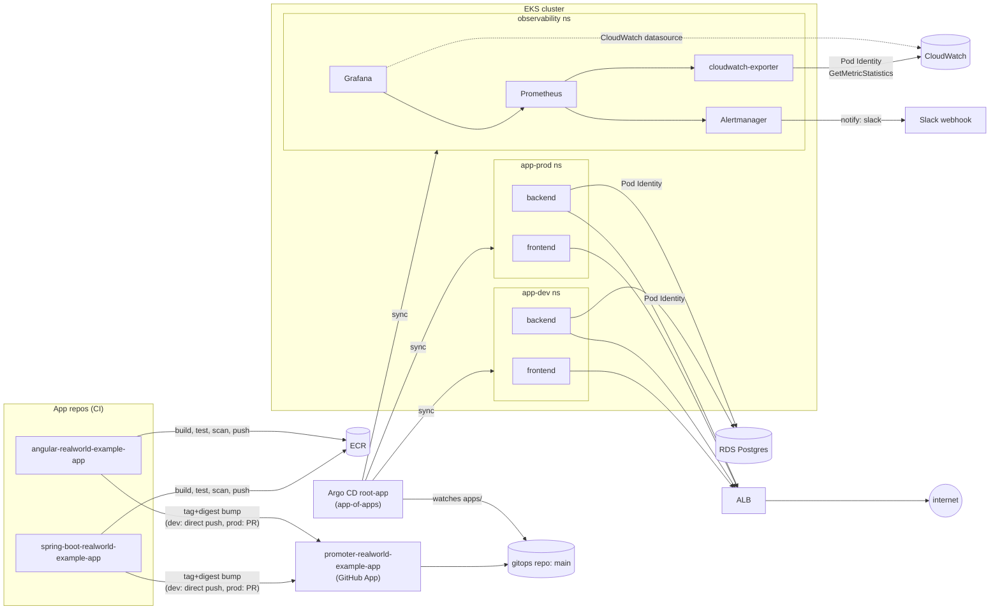

# infrastructure-realworld-example-app

Terraform for a RealWorld demo (Spring Boot + Angular) running on EKS. Solo project, portfolio piece, actually live in `us-east-1` — not just `terraform plan` output.

This repo is the AWS side: VPC, EKS, RDS, IAM. Everything that runs inside the cluster (Argo CD, Helm charts, alerts) lives in [gitops-realworld-example-app](https://github.com/Dado555/gitops-realworld-example-app).

## Architecture



Short version: app repos build and push to ECR, a GitHub App bot bumps the tag/digest in the gitops repo, Argo CD picks that up and rolls it out. Backend and the CloudWatch exporter talk to AWS through Pod Identity, Alertmanager pages a Slack channel.

## What's running

- VPC across 2 AZs, private subnets for app + db, NAT gateway
- EKS 1.36 on 3x t3.medium, AL2023 nodes bootstrapped via `nodeadm`
- RDS Postgres 14.24 on a `db.t4g.micro` — small on purpose, this is a demo
- Argo CD (app-of-apps) syncing backend + frontend, dev and prod, plus the observability stack
- kube-prometheus-stack, plus a CloudWatch exporter for RDS metrics Prometheus can't reach on its own
- One ALB shared between dev and prod via ingress groups — no spare money for two
- Two ECR repos, images promoted into gitops by a GitHub App

## Layout

```
terraform/
  bootstrap/            # state backend, applied once by hand
  envs/
    dev/  {network,platform,data}/
    prod/ {network,platform,data}/
    shared/iam/          # ECR repos, CI users/roles
  modules/
```

Every `<env>/<component>` has its own state file, so a network change in dev physically can't touch prod's data, and platform can't touch data even inside the same env. [docs/terraform.md](docs/terraform.md) has the original reasoning for the split — it was written before any of this existed, but the layout held up.

## Getting in

- Frontend (dev): http://k8s-realworlddev-f71b31f6f1-1151405426.us-east-1.elb.amazonaws.com/
- Backend API: same host, `/api`
- Prod sits on the same ALB, different ingress group
- Argo CD and Grafana are both ClusterIP only, no public URL:
  ```
  kubectl port-forward svc/argocd-server -n argocd 8080:443
  kubectl port-forward svc/observability-grafana -n observability 3000:80
  ```
  Argo's initial-admin secret is long gone (password got changed early on) — reset it with the `argocd` CLI if you need in.

## Why it's built this way

A few things worth knowing before poking around, roughly in the order you'd trip over them.

Everything in-cluster talks to AWS through Pod Identity, not IRSA/OIDC. Wanted OIDC originally, but this account has an org-level SCP that blocks setting up an identity provider at all — found that out the hard way, not a stylistic pick. Same SCP blocks SES outright, which is the actual reason alerts go to Slack and not email.

The backend deployment pins its image by digest, not tag. The tag sitting next to it in the values files is purely for a human glancing at a diff — it has zero effect on what actually gets deployed.

Migrations run as their own Argo PreSync job instead of Flyway-on-boot, so a bad migration can't half-apply itself inside an already-running pod.

Nodes bootstrap via AL2023's `nodeadm`, not the old `bootstrap.sh` shell flags. Fun one: EC2 flatly rejects a plain, non-multipart user-data document even when there's only a single thing in it, so the launch template wraps it in a MIME envelope for no reason other than EC2 insisting on it.

Alertmanager's default receiver is the chart's own built-in null, not actual silence — that keeps the ~150 stock kube-prometheus-stack rules evaluating and visible in the Prometheus UI, they just never page anyone. On top of that there are exactly 5 custom alerts: backend availability, backend latency, pod crash-looping, RDS storage/connections, and Argo app health.

RDS metrics reach Prometheus through `prometheus-cloudwatch-exporter`, and getting that actually working needed two separate fixes worth writing down so I don't have to rediscover them: the exporter timestamps every sample with CloudWatch's own datapoint time, which runs 15-20 minutes behind wall clock, and Prometheus's default out-of-order window is 0s — so it was silently dropping every sample on arrival while the scrape itself looked perfectly healthy. Widened that window to 30m. Then, even with ingestion fixed, the default query lookback (5m) was still shorter than that same lag, so a plain query against the metric came back empty anyway — the alert rules wrap it in `last_over_time(...[20m])` instead.

Image promotion runs through a scoped-down GitHub App rather than a personal token. Each app repo's CI mints a short-lived installation token, pushes straight to dev, and opens (never merges) a PR for prod that needs an actual review to land.

## What's still rough

No alert catches a pod stuck permanently NotReady because it can't reach the database. Turns out HikariCP here initializes lazily, so a bad DB connection doesn't crash the JVM — which is the only thing the crash-loop alert watches for — it just leaves the readiness probe failing forever. And a pod that's never Ready never receives traffic, so the availability alert never sees it either. Found this mid-drill, haven't closed it yet.

`app-dev`'s CPU quota is tighter than it looks. A normal rolling deploy plus the PreSync migration job running at the same time can eat the whole thing, and when that happens the migration job can't even get scheduled — which means the deploy can't finish either. Hit this for real during a rollback drill and it ate most of the recovery time. Should raise the quota or back off maxSurge, haven't decided which yet.

RDS has no storage autoscaling on, so a slow leak won't fix itself — it'll just page someone eventually.

This cluster's kernel apparently lets non-root processes bind to ports below 1024. Found that out trying to build a failure drill around it, and it just… worked, no permission error at all. Not a security hole on its own, just don't assume port 80 needs root here.

Most of the runbooks in the gitops repo's `docs/runbooks/` are still unvalidated on paper — only the rollback one has actually been drilled for real.
