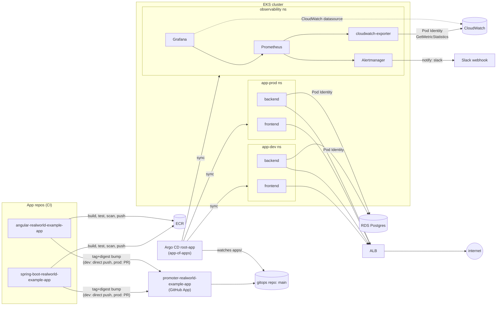

# infrastructure-realworld-example-app

Terraform for a RealWorld demo app (Spring Boot backend + Angular frontend) running on AWS EKS,
deployed via GitOps. One engineer, portfolio project, live in `us-east-1`.

This repo owns the AWS side: VPC, EKS, RDS, IAM. The [gitops repo](https://github.com/Dado555/gitops-realworld-example-app)
owns everything inside the cluster (Argo CD, Helm charts, alerts, runbooks).

## Architecture



## What's live

- VPC, 2 AZs, private app/db subnets, NAT
- EKS 1.36, 3x t3.medium managed node group, AL2023 (`nodeadm`)
- RDS Postgres 14.24, `db.t4g.micro`, managed master password via Secrets Manager
- Argo CD (Helm-installed, app-of-apps), syncing backend/frontend (dev+prod) + observability
- kube-prometheus-stack (Prometheus/Grafana/Alertmanager) + `prometheus-cloudwatch-exporter`
- AWS Load Balancer Controller, one shared internet-facing ALB per env via ingress groups
- ECR (`realworld-backend`, `realworld-frontend`), promoted into gitops by a GitHub App

## Repo layout

```
terraform/
  bootstrap/            # state backend (S3 + DynamoDB + KMS), applied once, own local state
  envs/
    dev/  {network,platform,data}/   # own state file each - blast radius stays per component
    prod/ {network,platform,data}/
    shared/iam/          # ECR repos, CI IAM users/roles
  modules/                # vpc, eks, rds, ecr-repo, backups, iam-ci-user, github-oidc-role
```

Each `<env>/<component>` is its own Terraform state, so a `dev/network` change can't touch
`prod/data`, and a `platform` change can't touch `data`'s state even in the same env. See
[docs/terraform.md](../docs/terraform.md) for the original reasoning behind this split (written
early — the directory layout is still accurate, the "no resources yet" framing is not; everything
above is built and live).

## Setup / access

- **Dev frontend**: http://k8s-realworlddev-f71b31f6f1-1151405426.us-east-1.elb.amazonaws.com/
  (internet-facing ALB, plain HTTP)
- **Dev backend API**: same host, `/api` (ALB ingress group `realworld-dev`, path-based routing)
- **Prod**: same shared ALB, different ingress group order — also live
- **Argo CD UI** — ClusterIP only, no public ingress:
  ```
  kubectl port-forward svc/argocd-server -n argocd 8080:443
  ```
  then open https://localhost:8080. `admin.enabled=true`; the `argocd-initial-admin-secret` was
  already deleted (password was customized earlier) — reset it with the `argocd` CLI or `kubectl`
  if you don't have it.
- **Grafana** — ClusterIP only:
  ```
  kubectl port-forward svc/observability-grafana -n observability 3000:80
  ```

## Design decisions

- **Pod Identity, not IRSA/OIDC**, for every in-cluster AWS caller (LB controller, cloudwatch-exporter,
  external-secrets, EBS CSI). This account has an org-level SCP that blocks setting up an OIDC
  identity provider — found live, not a preference.
- **Same SCP blocks SES** — that's why Alertmanager notifies a Slack webhook instead of email.
- **AL2023 nodes bootstrap via `nodeadm`** (`node.eks.aws/v1alpha1` `NodeConfig`), not the old
  `bootstrap.sh` shell flags. A plain (non-multipart) user-data document was rejected outright by
  a real `apply` (`Ec2LaunchTemplateInvalidConfiguration`) — EC2 requires the MIME-multipart
  envelope even for a single document.
- **Backend Deployment pins the image by digest** (`repository@digest`), not tag. The tag field
  stays in the values files for human traceability only — it has zero effect on what actually
  deploys.
- **Migrations run as a separate Argo PreSync hook Job** (Flyway-only, web server disabled via
  `--spring.main.web-application-type=none`), not Flyway-on-boot — `SPRING_FLYWAY_ENABLED=false`
  at the app level.
- **Alertmanager's default receiver is the chart's built-in `null`**, not silence. This keeps
  kube-prometheus-stack's ~150 default rules evaluating and visible in the Prometheus UI for
  context, without paging anyone. Explicit routes: `Watchdog` → null, anything labeled
  `notify: "slack"` → the real Slack receiver.
- **Only 5 custom alerts exist, deliberately**: backend availability SLO, backend latency SLO,
  pod crash-looping, RDS storage/connections near limit, Argo Application unhealthy.
- **RDS CloudWatch metrics reach Prometheus via `prometheus-cloudwatch-exporter`** (the older
  JVM-based exporter, which calls the legacy `GetMetricStatistics` API, not `GetMetricData`).
  Two non-obvious tuning fixes were needed, both live-verified:
  - This exporter stamps each sample with CloudWatch's own datapoint timestamp, not scrape time —
    that timestamp runs ~15–16 minutes behind wall-clock (RDS's own publishing lag plus the
    exporter's 5-minute statistics period). Prometheus's `out_of_order_time_window` defaults to
    `0s`, so every sample was silently dropped at ingestion despite the scrape itself succeeding.
    Fixed by setting the window to `30m`.
  - Even with ingestion fixed, Prometheus's default `query.lookback-delta` (5m) is smaller than
    that same ~15–16m lag, so a bare instant PromQL selector never matches. Alert rules for these
    metrics wrap them in `last_over_time(metric[20m])` instead of querying the bare metric.
- **Image promotion runs through a GitHub App** (`promoter-realworld-example-app`), not a bot
  with a long-lived PAT. Each app repo's CI mints a short-lived installation token scoped only to
  the gitops repo, pushes the dev tag+digest bump straight to `main`, and opens (never merges) a
  PR for prod — gated by CODEOWNERS review.

## Known gaps

- **No alert covers a replica stuck permanently `NotReady`** from an unreachable database. This
  backend's HikariCP pool initializes lazily, so a bad DB connection doesn't crash the JVM (what
  `PodCrashLooping` watches for) — it just leaves the readiness probe failing forever. A
  `NotReady` pod never receives traffic, so the availability SLO alert doesn't see it either.
  Confirmed live during the alert-drill. A real blind spot for this specific failure mode.
- **`app-dev`'s `ResourceQuota` (`limits.cpu: 4`) is tight** enough that during a stuck/bad
  rollout, one extra surge replica can consume enough headroom to block the PreSync migration Job
  from scheduling at all — confirmed live during the 2026-08-29 rollback drill, where it cost
  most of the ~9.5-minute recovery time. Worth either raising the quota or reducing HPA
  `maxReplicas` / rollout `maxSurge`.
- **RDS has no storage autoscaling configured** (`MaxAllocatedStorage` unset) — a slow storage
  leak doesn't self-heal, it pages someone.
- **This EKS node's kernel allows unprivileged (non-root) binding to ports <1024**
  (`net.ipv4.ip_unprivileged_port_start=0`) — found live while trying to construct a failure
  drill. Not a vulnerability by itself, but worth knowing if any security reasoning assumes
  port <1024 requires root in this cluster.
- **Runbooks are mostly unvalidated.** `docs/runbooks/rollback.md` (gitops repo) was drilled live
  on 2026-08-29 and updated with real findings (recovery time, the quota gotcha above, a
  `kubectl rollout undo` footgun under Argo's `selfHeal`). `backend-down.md`, `high-latency.md`,
  `db-issues.md`, and `incident-response.md` are still marked "not yet validated by drill." The
  `PodCrashLooping` drill was mid-flight — testing `drillBadDbUrl` → `drillPrivilegedPort` →
  `drillBadServerPort` in `realworld-backend-dev`'s values — and got reverted/paused before
  landing a result; it hasn't been picked back up since.
